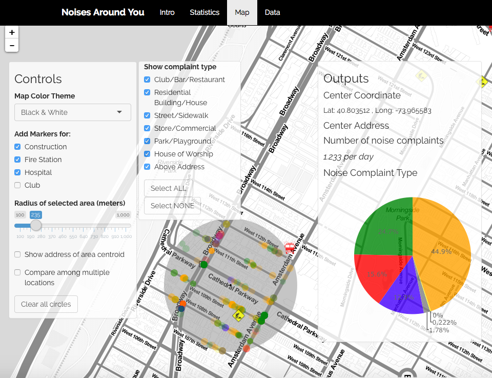

# Project: Open Data NYC - an RShiny app development project
### [Project Description](doc/project2_desc.md)

Term: Fall 2016

+ Team #8
+ Project title: Noise around you
+ Team members
	+ Song, Shuli
	+ Zhang, Chi
	+ Chen, Zheyuan
	+ Gao, Yinxiang
	+ Zhang, Wanyi

+ Project summary:

   This project focused the noise level distribution in New York City by integrating the analyses of the 311 complaints data, the geographical data of construction sites, fire stations, hospitals and clubs in NYC. It's showcased by a shinyApp which includes 3 main tabs: statistics, map and data.

   + Statistics: 
   The statistical analysis tab visualized the exploritary analysis of the noise data, inlcuding the numbers of noise complaints by time series and locations, and the types of noise complaints proportional distribution.
   
   + Map: 
   This tab is an interactive app which enables users to choose any location in New York City and the algorithms will automatically calculate and output the geographical information, and the sources of noise around the point by the radius which also can be altered by users.
   
   + Data: 
   Original data which we were using to conduct the analysis and write the algorithms. It also contains the searching and sorting functions of the data.
	
   Hope this app can help New Yorkers to find their peaceful land!

+ Contribution Statement:

    The team worked tightly together and all put in tons of efforts on the project. Worth to be mentioned, Gao Yinxiang made an outstanding contribution on framework designing and coding of the app. 
